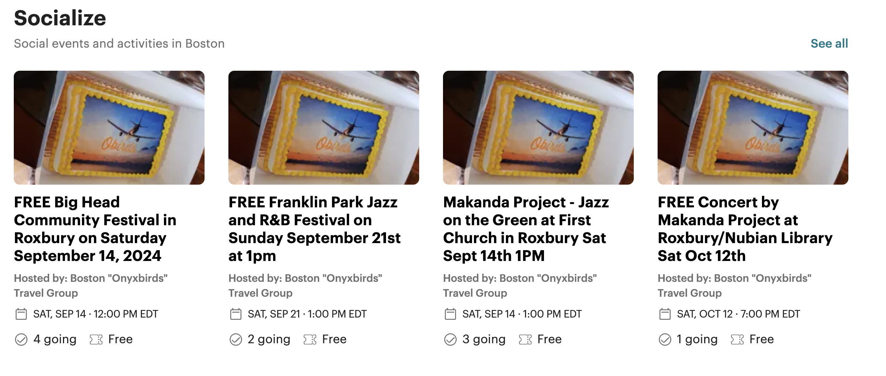
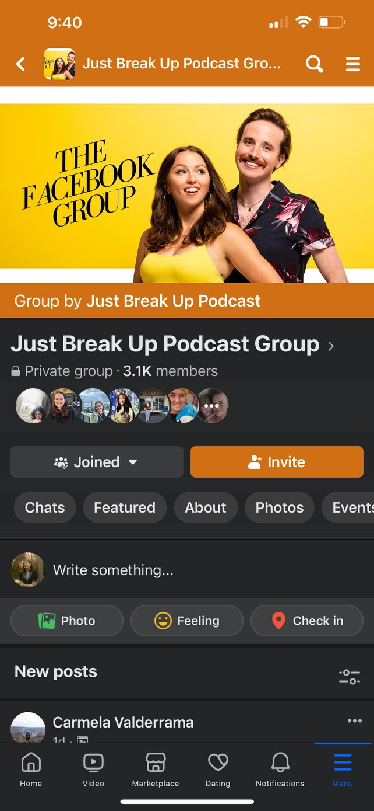
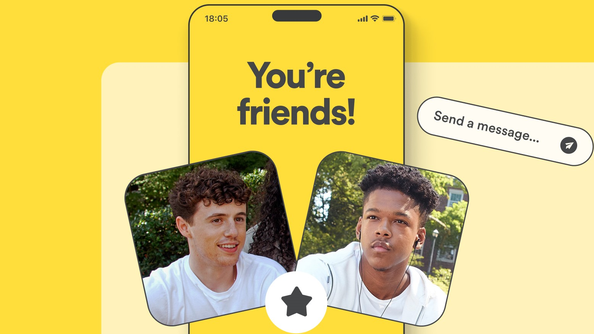
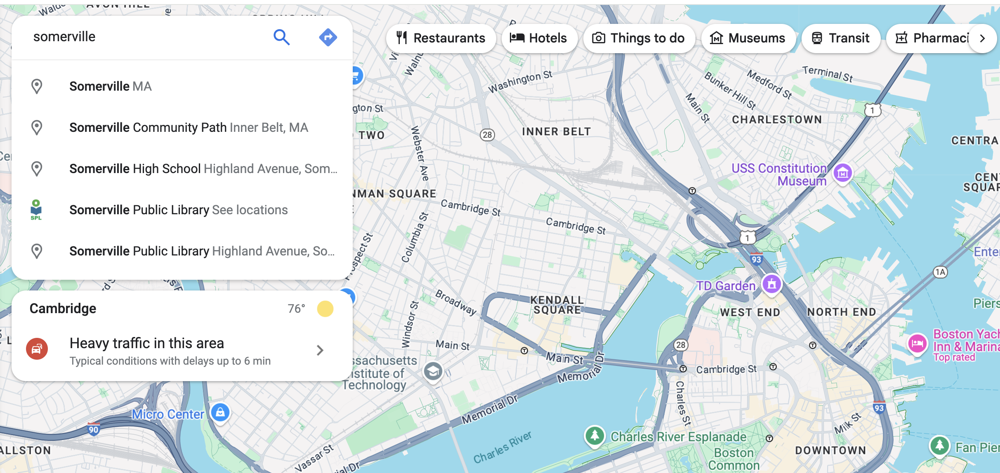
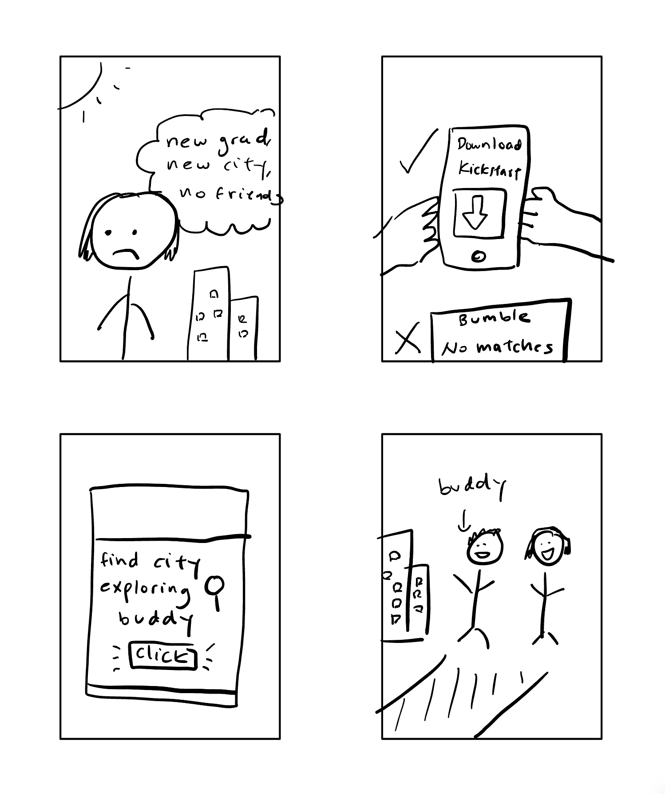
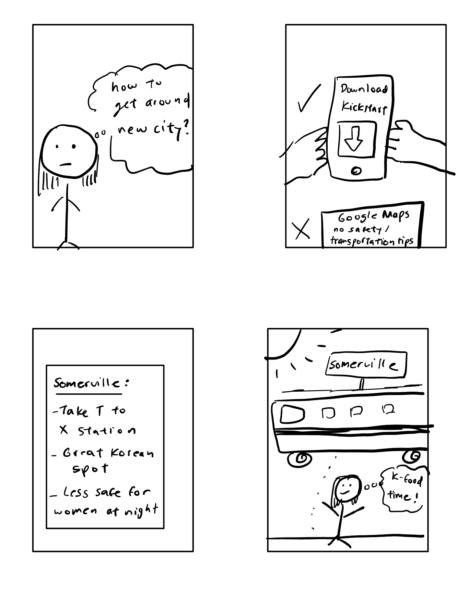

# Assignment 2

**Urban Kickstart**
For new grads in new cities

Urban Kickstart (Kickstart for short) is a social media app designed specifically to acclimate new grads to cities they just moved into. It motivates users to learn about the city’s housing/transportation/safety tips, explore stores, attend events, and meet people by gamifying the process: users get local store discounts/freebies for participating.

**Scrapbook of Comparables**

|  |
|:--:| 
| *Events image from Meetup* |

Finding and filtering events by certain dates on Meetup: this idea can be improved by motivating users to attend by describing the local store discounts they may receive from it.

|  |
| :--------------------------: |
|  *Locked Group image from Facebook*  |

This image is from a private Facebook Group. The private feature does not encourage inclusivity, so I’ll remove the locked feature but may keep several of the same group dynamics. 

|    |
| :--------------------------------: |
| *Friend match from Bumble* |

This image is from Bumble, and shows a matching between friends. As my interviewee noted, it’s intimidating and restricting to only be able to connect with someone via matches, and Bumble suffers from superficial compability (ie: only matching people based on surface-level interests). To foster unity, this “matching” feature will only be represented via DMs; both parties have to accept/agree before privately messaging. On the other hand, my app will have lots of space for anyone to publicly or anonymously comment on blogs and events.  

|  |
| :----------------------------------: |
|      *Interactive maps from Google Maps*      |

This image is from Google Maps, which shows landmarks and things to do in Boston. It’s best used when you’ve already done homework on the area and figured out what people recommend. My app would have an interactive map similar to this, but exclusively provide safety tips, how to get to locations, and best places to eat/visit according to other new grads. 

**Brainstorming Feature Ideas**

1) Personalized City Dashboard

Upon joining, users create a profile and provide their interests, hobbies, and preferences for social activities (e.g., music events, food festivals, art galleries, sports, etc). A personalized dashboard shows curated lists of events and activities happening around them, based on their preferences.

2) City Onboarding Challenges

The app will display fun challenges and tasks to help users explore their new city (e.g., “Visit 5 iconic landmarks,” “Try 3 local food spots,” “Attend a local market”). Rewards, badges, or discounts will be given for completing challenges.

3) Local Business Partnerships

Like UberEats, Kickstart will partner with local businesses in order to be able to provide discounts, rewards, and freebies to users who participate in events and challenges. Free food is often a big motivator for students and the younger generation, so I see this as a significant incentive for users. 

4) Local Events and Meetups

Like Meetup and Eventbrite, the app will contain a calendar view of events happening in the city, such as concerts, street festivals, local markets, workshops, happy hours, and more.
The app will include filters to sort events by type (e.g., social, networking, cultural), price (free vs. paid), and the option to RSVP, buy tickets, or share events with others.

5) Neighborhood Maps

The app will display an interactive map of the city and its neighborhoods. Users can click on locations and see notes posted about transportation, housing, safety tips, and best places to visit. Users can also write their own notes and upvote others. 

6) Social Geocaching

Similar to Pokemon Go, users can travel to destinations that have hidden notes/requests to connect. It’s a little riskier given tracking privacy and safety, but perhaps the app would only let business owners post messages that contain promo codes for their food/items. Maybe the app would also allow users to write one message per account at a pre-verified local store - not just any random location. The messages would expire in one week. 

7) Beginner Blogs

Many “how to explore the city” blogs are written by reporters or sponsored writers. I envision that my app will instead have intro blogs written by real users that are new to the city. Topics will include favorite shops, how to use the T, or any other helpful anecdotes. Users can upvote blogs and contact the writer safely through the app using the comments section (not personal messaging). 

8) App Messaging

The app will provide a way for users to message each other given a unique username/handle, like a limited Discord. The way for another user to discover a handle of another user is through revealing it on geocached-hidden messages or providing their handle on a blog they wrote. They can also choose to write the blog anonymously. 

9) Groups Chats

The app will allow group chats, once every person has discovered/accepted the other’s handle. 

10) Disable Messaging

Users will have the option to disable messaging for privacy reasons. 

11) Change Handle

For the same privacy reasons, users will be able to change their handle/username. 

12) Social Groups

Like Facebook Groups, users can join various social groups about events, sports, etc. These groups will be open for anyone to join. 

13) Find Local Alums

Users will be able to find who else from their school is on the app. Users won’t be able to message alums directly, but they’ll be able to send a friend request that the other user must accept before messaging. 

14) Avatars

Users will be able to change their avatars and accumulate points to get upgraded avatars. 

15) Donate points
    
Users can choose to donate points to others anonymously or publicly.  

**VSD Analysis**

- Stakeholders
    - The app is designed for new grads, but the plan doesn’t currently specify how long ago a person has graduated, and whether it’s from undergrad, grad, trade school, etc. Because people finish school at all different ages, the app will not discriminate solely based on age. It’ll be based on trust and community-driven, like Reddit. A possible effect is that people of widely varying ages can be on the app (ie: ~20 year olds to ~50 year olds). However, I don’t envision this to be a downside. What unifies these groups is their past history in school, and the shared experience of moving to a new city. 

- Time
    - After a new grad has been out of school for 5+ years, they may phase out of this app designed for new grads. However, I see this process as similar to Hinge: the app is designed not for persistent long term use, and can be “deleted” once it serves its purpose. Users who make connections on the app can continue them outside the app at their own leisure. 

    - This app will also serve adults who re-enter school after long periods. Many apps are designed for young, 20-year old grads, but I see a non-trivial user group being adults in their 30s-40s who download this app to connect with other adult new grads who resumed school after having children, switching jobs, etc. After future homework iterations, perhaps this could be the key audience for this app.  

- Values
    - The app is designed to support local businesses through its rewards service. It also promotes exercise by incentivising users to walk/explore the city. However, shops must already give permission to have their location publicly advertised on the app. Otherwise, they may get an unpredictable amount of customers or solicitors blocking their venue. (*Brainstorming credit: Israel Wong)

- Pervasiveness
    - My app contains a feature that allows students to connect by school. However, schools already have alum connection networks and this feature segregates users by school, allowing schools with greater populations to increase the likelihood that users connect. However, I still believe this is a good starting point for users to get comfortable with meeting others; people from the same school can come from a variety of backgrounds and consequently this feature will not inhibit diversity. 

**Storyboards**
|  |
| :----------------------------------: |
|      *Find a city exploring buddy*      |

This sketch details the process of finding a buddy to explore a new city with. Unlike Bumble, the immediate goal isn't necessarily to find someone who shares the same interests, as Bumble sometimes suffers from superficial compatability. Instead, the goal is to meet with someone with similar school experience who's looking forward to attending local-store sponsored events. However, it's still unclear how the algorithm would match people (would it suggest X matches or automatically pair you with someone?), and other privacy concerns that may arise. 

|  |
| :-------------------------------------------------: |
|            *Navigating around the city*            |

This sketch shows how a user was inspired to travel to Somerville for Korean food. Kickstart was able to describe how to use the T or other transportation means to get there, and also to be wary of traveling in certain areas at night by oneself, especially for women. Therefore, the user (a woman) is seen traveling to a Korean spot during the day. 